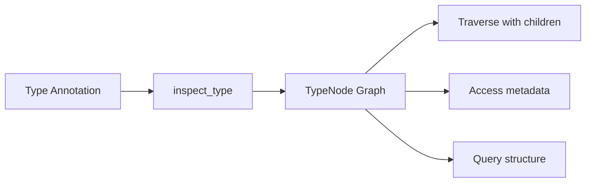
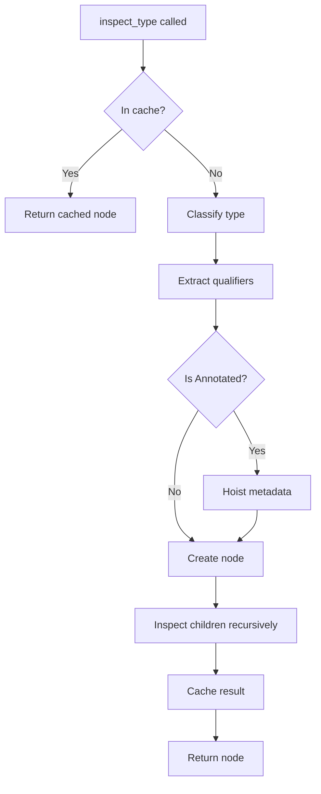
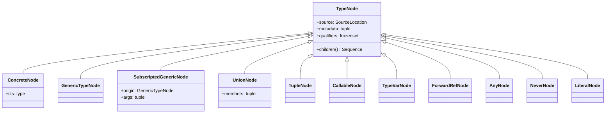

# Architecture overview

This page explains the high-level architecture of typing-graph, how its components work together, and the design decisions behind them.

## Core concepts

typing-graph transforms Python type annotations into a traversable graph of nodes. Each node represents a component of a type annotation, from simple types like `int` to complex nested generics like `dict[str, list[Annotated[int, Gt(0)]]]`.



The library has three main layers:

1. **Inspection layer** - Functions that analyze types and produce nodes
2. **Node layer** - Dataclasses representing type structure
3. **Configuration layer** - Options controlling inspection behavior

## The inspection layer

### Entry points

The inspection layer provides focused functions for different inspection tasks:

| Function | Purpose |
| -------- | ------- |
| [`inspect_type()`][typing_graph.inspect_type] | Inspect any type annotation |
| [`inspect_class()`][typing_graph.inspect_class] | Auto-detect and inspect a class |
| [`inspect_dataclass()`][typing_graph.inspect_dataclass] | Inspect dataclass specifically |
| [`inspect_typed_dict()`][typing_graph.inspect_typed_dict] | Inspect TypedDict specifically |
| [`inspect_function()`][typing_graph.inspect_function] | Inspect function signature |
| [`inspect_module()`][typing_graph.inspect_module] | Discover types in a module |

Each function accepts an optional [`InspectConfig`][typing_graph.InspectConfig] to customize behavior.

### The inspection process

When you call `inspect_type()`, the library:

1. **Checks the cache** - Returns cached result if available
2. **Classifies the type** - Determines which node type to create
3. **Extracts qualifiers** - Identifies `ClassVar`, `Final`, `Required`, etc.
4. **Hoists metadata** - Moves `Annotated` metadata to the base type (if enabled)
5. **Recursively inspects** - Processes nested types to build child nodes
6. **Caches the result** - Stores for future lookups



### Metadata hoisting

When the library encounters `Annotated[T, meta1, meta2]`, it can either:

- **Hoist metadata** (default): Create a node for `T` with `metadata=(meta1, meta2)`
- **Preserve wrapper**: Create an `AnnotatedNode` node containing the base and annotations

Hoisting simplifies working with annotated types since you get the underlying type directly with metadata attached.

```python
# snippet - illustrative pseudocode
# With hoisting (default)
node = inspect_type(Annotated[str, MaxLen(100)])
# Returns: ConcreteNode(cls=str, metadata=(MaxLen(100),))

# Without hoisting
config = InspectConfig(hoist_metadata=False)
node = inspect_type(Annotated[str, MaxLen(100)], config=config)
# Returns: AnnotatedNode(base=ConcreteNode(cls=str), annotations=(MaxLen(100),))
```

## The node layer

### Node hierarchy

All type representations inherit from [`TypeNode`][typing_graph.TypeNode], which provides the common interface:



### Node categories

Nodes fall into these categories based on what they represent:

**Concrete types** represent non-generic nominal types:

- [`ConcreteNode`][typing_graph.ConcreteNode] - Simple types like `int`, `str`, custom classes

**Generic types** represent parameterized types:

- [`GenericTypeNode`][typing_graph.GenericTypeNode] - Unsubscripted generics like `list`, `Dict`
- [`SubscriptedGenericNode`][typing_graph.SubscriptedGenericNode] - Applied generics like `list[int]`
- [`GenericAliasNode`][typing_graph.GenericAliasNode] - Generic class aliases

**Composite types** combine other types:

- [`UnionNode`][typing_graph.UnionNode] - Union types (`A | B`, `Union[A, B]`)
- [`TupleNode`][typing_graph.TupleNode] - Tuple types (heterogeneous and homogeneous)
- [`CallableNode`][typing_graph.CallableNode] - Callable signatures

**Special forms** represent typing system constructs:

- [`AnyNode`][typing_graph.AnyNode] - `typing.Any`
- [`NeverNode`][typing_graph.NeverNode] - `typing.Never`
- [`SelfNode`][typing_graph.SelfNode] - `typing.Self`
- [`LiteralNode`][typing_graph.LiteralNode] - `Literal[...]` values

**Type parameters** represent generic placeholders:

- [`TypeVarNode`][typing_graph.TypeVarNode] - Type variables
- [`ParamSpecNode`][typing_graph.ParamSpecNode] - Parameter specifications
- [`TypeVarTupleNode`][typing_graph.TypeVarTupleNode] - Variadic type variables

**Structured types** represent classes with fields:

- [`DataclassNode`][typing_graph.DataclassNode] - Dataclasses
- [`TypedDictNode`][typing_graph.TypedDictNode] - TypedDict classes
- [`NamedTupleNode`][typing_graph.NamedTupleNode] - NamedTuple classes
- [`ProtocolNode`][typing_graph.ProtocolNode] - Protocol definitions
- [`EnumNode`][typing_graph.EnumNode] - Enum classes

### Memory efficiency and immutability

The library implements all nodes as frozen dataclasses with `slots=True` for memory efficiency and immutability. This design:

- Reduces memory footprint via `__slots__`
- Guarantees immutability after construction via `frozen=True`
- Enables safe caching (code cannot mutate nodes)
- Makes nodes hashable (usable as dictionary keys and in sets)
- Ensures thread safety for concurrent read access

Classes with computed fields (like `_children`) use `object.__setattr__` in `__post_init__` to set derived values during initialization, before the object becomes fully frozen.

### The children method

Every node implements `children()` to enable graph traversal:

```python
# snippet - simplified internal implementation
@dataclass(slots=True, frozen=True)
class SubscriptedGenericNode(TypeNode):
    origin: GenericTypeNode
    args: tuple[TypeNode, ...]

    def children(self) -> Sequence[TypeNode]:
        return self.args  # Type arguments are the children
```

What counts as "children" depends on the node type:

- `SubscriptedGenericNode` → type arguments
- `UnionNode` → union members
- `DataclassNode` → field types
- `ConcreteNode` → empty (leaf node)

## The configuration layer

### InspectConfig

[`InspectConfig`][typing_graph.InspectConfig] controls all aspects of inspection:

```python
@dataclass(slots=True)
class InspectConfig:
    eval_mode: EvalMode = EvalMode.DEFERRED
    globalns: dict | None = None
    localns: dict | None = None
    max_depth: int | None = None
    hoist_metadata: bool = True
    include_source_locations: bool = False
    # ... class inspection options
```

### Forward reference handling

The `eval_mode` option controls how the library handles forward references:

| Mode | Behavior |
| ---- | -------- |
| `EAGER` | Resolve immediately, fail on errors |
| `DEFERRED` | Create `ForwardRefNode` nodes for unresolvable references |
| `STRINGIFIED` | Keep as strings, resolve lazily |

`DEFERRED` (the default) provides the best balance: resolution when possible, graceful handling when not.

### InspectContext

Internally, the library uses `InspectContext` to track state during inspection:

- **depth** - Current recursion level for depth limiting
- **seen** - Map of visited types for cycle detection
- **resolving** - Forward references the library currently resolves

The library passes this context through recursive calls but hides it from the public API.

## Caching

The library maintains a global cache of inspection results keyed by (type, config). This provides:

- **Performance** - Repeated inspection of the same type is instant
- **Consistency** - Same input always produces same node instance
- **Memory efficiency** - Complex type graphs are only built once

Cache management functions:

- [`cache_clear()`][typing_graph.cache_clear] - Clear all cached results
- [`cache_info()`][typing_graph.cache_info] - Get cache statistics (hits, misses, size)

## Integration with typing-inspection

typing-graph builds on [Pydantic's typing-inspection](https://typing-inspection.pydantic.dev/) library for low-level type introspection. This provides:

- Robust handling of Python version differences
- Correct qualifier extraction
- Forward reference evaluation utilities

The `Qualifier` Enum is re-exported from typing-inspection for convenience.

## Design principles

### Standard library first

The library minimizes dependencies, relying primarily on the standard library. External dependencies are carefully chosen:

- **typing-inspection** - Battle-tested type introspection from Pydantic
- **typing-extensions** - Backports of modern typing features
- **annotated-types** (optional) - Standard constraint vocabulary

### Immutable by design

The library freezes all TypeNode dataclasses, guaranteeing immutability after construction. Tuples store metadata (not lists), and qualifier sets use frozensets. This immutability enables nodes to be hashable, cached safely, and accessed concurrently without synchronization.

### Lazy evaluation

The library uses lazy evaluation where possible:

- The library builds type graphs on-demand
- Forward references can defer resolution
- Children use computed properties, not eager materialization

### Type safety

The library is fully typed and passes strict basedpyright checking. Type guard functions (`is_concrete_node()`, `is_union_type_node()`, etc.) enable type-safe node discrimination.
