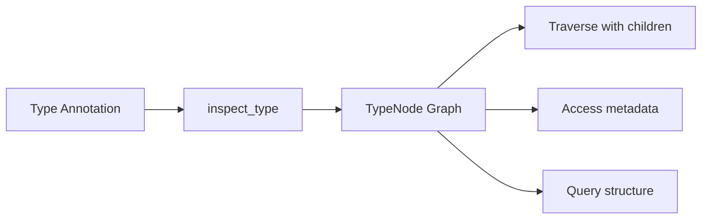
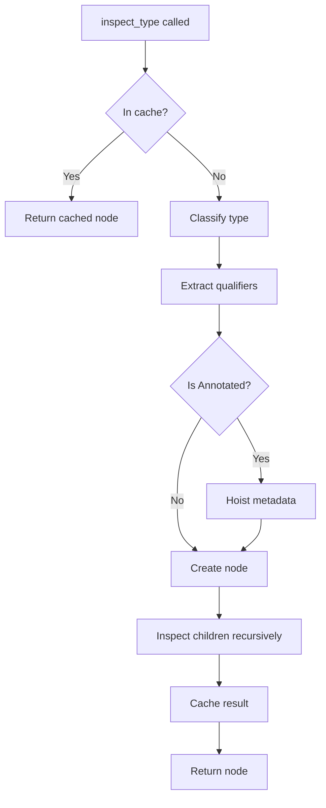

# Architecture overview

This page explains the high-level architecture of typing-graph, how its components work together, and the reasoning behind the design decisions. Understanding the architecture helps you work effectively with the library and appreciate why certain choices were made.

## Why typing-graph exists

Python's `typing` module provides rich type annotation capabilities, but working with these annotations programmatically is surprisingly difficult. The standard library offers `get_origin()`, `get_args()`, and `get_type_hints()`, but these low-level primitives leave significant work for library authors:

- Handling the many edge cases across Python versions
- Traversing nested types recursively
- Extracting metadata from `Annotated` wrappers
- Managing forward reference resolution
- Dealing with the subtle differences between `typing.Union` and `types.UnionType`

typing-graph addresses these challenges by providing a unified, graph-based representation of type annotations. Rather than working with raw type objects and their quirks, you work with a consistent node hierarchy that handles the complexity internally.

## Core concepts

typing-graph transforms Python type annotations into a traversable graph of nodes. Each node represents a component of a type annotation, from simple types like `int` to complex nested generics like `dict[str, list[Annotated[int, Gt(0)]]]`.



The library has three main layers:

1. **Inspection layer** - Functions that analyze types and produce nodes
2. **Node layer** - Dataclasses representing type structure
3. **Configuration layer** - Options controlling inspection behavior

## The inspection layer

### Entry points

The inspection layer provides focused functions for different inspection tasks:

| Function | Purpose |
| -------- | ------- |
| [`inspect_type()`][typing_graph.inspect_type] | Inspect any type annotation |
| [`inspect_class()`][typing_graph.inspect_class] | Auto-detect and inspect a class |
| [`inspect_dataclass()`][typing_graph.inspect_dataclass] | Inspect dataclass specifically |
| [`inspect_typed_dict()`][typing_graph.inspect_typed_dict] | Inspect TypedDict specifically |
| [`inspect_function()`][typing_graph.inspect_function] | Inspect function signature |
| [`inspect_module()`][typing_graph.inspect_module] | Discover types in a module |

Each function accepts an optional [`InspectConfig`][typing_graph.InspectConfig] to customize behavior.

### The inspection process

When you call `inspect_type()`, the library:

1. **Checks the cache** - Returns cached result if available
2. **Classifies the type** - Determines which node type to create
3. **Extracts qualifiers** - Identifies `ClassVar`, `Final`, `Required`, etc.
4. **Hoists metadata** - Moves `Annotated` metadata to the base type (if enabled)
5. **Recursively inspects** - Processes nested types to build child nodes
6. **Caches the result** - Stores for future lookups



### Metadata hoisting

When the library encounters `Annotated[T, meta1, meta2]`, it can either:

- **Hoist metadata** (default): Create a node for `T` with `metadata=(meta1, meta2)`
- **Preserve wrapper**: Create an `AnnotatedNode` node containing the base and annotations

Hoisting simplifies working with annotated types since you get the underlying type directly with metadata attached.

```python
# snippet - illustrative pseudocode
# With hoisting (default)
node = inspect_type(Annotated[str, MaxLen(100)])
# Returns: ConcreteNode(cls=str, metadata=(MaxLen(100),))

# Without hoisting
config = InspectConfig(hoist_metadata=False)
node = inspect_type(Annotated[str, MaxLen(100)], config=config)
# Returns: AnnotatedNode(base=ConcreteNode(cls=str), annotations=(MaxLen(100),))
```

!!! note "Design trade-off: hoisting by default"

    Hoisting is the default because most use cases want to work with the underlying type while having convenient access to metadata. The alternative (always preserving `AnnotatedNode` wrappers) would require consumers to constantly unwrap types to get to the actual type structure.

    However, some use cases genuinely need to distinguish "a string with metadata" from "a string." Round-trip serialization and type reconstruction are examples where preserving the exact annotation structure matters. That's why `hoist_metadata=False` exists.

## The node layer

### Node hierarchy

All type representations inherit from [`TypeNode`][typing_graph.TypeNode], which provides the common interface:


### Node categories

Nodes fall into these categories based on what they represent:

**Concrete types** represent non-generic nominal types:

- [`ConcreteNode`][typing_graph.ConcreteNode] - Simple types like `int`, `str`, custom classes

**Generic types** represent parameterized types:

- [`GenericTypeNode`][typing_graph.GenericTypeNode] - Unsubscripted generics like `list`, `Dict`
- [`SubscriptedGenericNode`][typing_graph.SubscriptedGenericNode] - Applied generics like `list[int]`
- [`GenericAliasNode`][typing_graph.GenericAliasNode] - Generic class aliases

**Composite types** combine other types:

- [`UnionNode`][typing_graph.UnionNode] - Union types (`A | B`, `Union[A, B]`)
- [`TupleNode`][typing_graph.TupleNode] - Tuple types (heterogeneous and homogeneous)
- [`CallableNode`][typing_graph.CallableNode] - Callable signatures

**Special forms** represent typing system constructs:

- [`AnyNode`][typing_graph.AnyNode] - `typing.Any`
- [`NeverNode`][typing_graph.NeverNode] - `typing.Never`
- [`SelfNode`][typing_graph.SelfNode] - `typing.Self`
- [`LiteralNode`][typing_graph.LiteralNode] - `Literal[...]` values

**Type parameters** represent generic placeholders:

- [`TypeVarNode`][typing_graph.TypeVarNode] - Type variables
- [`ParamSpecNode`][typing_graph.ParamSpecNode] - Parameter specifications
- [`TypeVarTupleNode`][typing_graph.TypeVarTupleNode] - Variadic type variables

**Structured types** represent classes with fields:

- [`DataclassNode`][typing_graph.DataclassNode] - Dataclasses
- [`TypedDictNode`][typing_graph.TypedDictNode] - TypedDict classes
- [`NamedTupleNode`][typing_graph.NamedTupleNode] - NamedTuple classes
- [`ProtocolNode`][typing_graph.ProtocolNode] - Protocol definitions
- [`EnumNode`][typing_graph.EnumNode] - Enum classes

### Memory efficiency and immutability

The library implements all nodes as frozen dataclasses with `slots=True` for memory efficiency and immutability. This design:

- Reduces memory footprint via `__slots__`
- Guarantees immutability after construction via `frozen=True`
- Enables safe caching (code cannot mutate nodes)
- Makes nodes hashable (usable as dictionary keys and in sets)
- Ensures thread safety for concurrent read access

Classes with computed fields (like `_children`) use `object.__setattr__` in `__post_init__` to set derived values during initialization, before the object becomes fully frozen.

### The children method

Every node implements `children()` to enable graph traversal:

```python
# snippet - simplified internal implementation
@dataclass(slots=True, frozen=True)
class SubscriptedGenericNode(TypeNode):
    origin: GenericTypeNode
    args: tuple[TypeNode, ...]

    def children(self) -> Sequence[TypeNode]:
        return self.args  # Type arguments are the children
```

What counts as "children" depends on the node type:

- `SubscriptedGenericNode` → type arguments
- `UnionNode` → union members
- `DataclassNode` → field types
- `ConcreteNode` → empty (leaf node)

## Graph traversal

The [`children()`][typing_graph.TypeNode.children] method provides structural traversal, but many use cases require semantic context: knowing whether a child is a dictionary key versus value, or a function parameter versus return type. The [`edges()`][typing_graph.TypeNode.edges] method complements `children()` by providing this relationship metadata through [`TypeEdgeConnection`][typing_graph.TypeEdgeConnection] objects.

### Edges caching

Both `children()` and `edges()` return pre-computed results with no allocation overhead at call time. The library computes these values once during node construction in `__post_init__`, storing them as tuples:

```python
# snippet - simplified internal pattern
@dataclass(slots=True, frozen=True)
class SubscriptedGenericNode(TypeNode):
    origin: GenericTypeNode
    args: tuple[TypeNode, ...]
    _children: tuple[TypeNode, ...] = field(init=False, repr=False)
    _edges: tuple[TypeEdgeConnection, ...] = field(init=False, repr=False)

    def __post_init__(self) -> None:
        # Compute once at construction, before freeze
        object.__setattr__(self, "_children", self.args)
        object.__setattr__(self, "_edges", self._build_edges())

    def children(self) -> Sequence[TypeNode]:
        return self._children  # Direct return, no computation

    def edges(self) -> Sequence[TypeEdgeConnection]:
        return self._edges  # Direct return, no computation
```

This design follows the principle of paying for what you use: `children()` returns the lightweight tuple directly for simple traversal, while `edges()` provides the richer semantic context when needed. Neither method performs work at call time because both return pre-built results.

!!! info "Why tuples instead of lists?"

    Tuples provide three benefits over lists. First, they are immutable, which aligns with the frozen dataclass design. Second, they are hashable, enabling nodes to participate in sets and dictionary keys. Third, they consume slightly less memory than equivalent lists. For collections that never change after construction, tuples are the natural choice.

### Thread safety

The combination of frozen dataclasses and immutable tuples makes type nodes safe for concurrent read access without synchronization. Multiple threads can call `children()` and `edges()` simultaneously on the same node with no risk of data races or inconsistent views.

This thread safety emerges from the design rather than explicit locking. Because nodes cannot change after construction and the returned tuples are also immutable, there is no shared mutable state to protect. Each thread receives a reference to the same unchanging data.

The global inspection cache also benefits from this design. Once a node is cached, any thread can retrieve and traverse it safely. The only synchronization needed is in the cache insertion path, which the library handles internally.

For more on how edges encode semantic relationships like key/value and parameter/return, see [Graph edges and semantic relationships](graph-edges.md).

<!-- vale Google.Headings = NO -->

## MetadataCollection

<!-- vale Google.Headings = YES -->

Every [`TypeNode`][typing_graph.TypeNode] carries a `metadata` attribute containing any metadata attached via `Annotated`. The [`MetadataCollection`][typing_graph.MetadataCollection] class provides an immutable, type-safe container for this metadata.

### Design principles

`MetadataCollection` follows the same design principles as the node layer:

- **Immutable**: All transformation methods return new collections
- **Memory efficient**: The `EMPTY` singleton avoids allocating empty collections
- **Thread-safe**: Immutability enables safe concurrent access
- **Sequence protocol**: Works naturally with standard Python patterns

### Rich query API

The collection provides specialized methods for metadata operations:

- **Query**: `find()`, `find_all()`, `find_first()`, `get()`, `get_required()`
- **Existence**: `has()`, `count()`, `is_empty`
- **Filter**: `filter()`, `filter_by_type()`, `first()`, `any()`
- **Protocol**: `find_protocol()`, `has_protocol()`, `count_protocol()`
- **Transform**: `exclude()`, `unique()`, `sorted()`, `reversed()`, `partition()`, `map()`
- **Introspection**: `types()`, `by_type()`

See [Metadata and Annotated](metadata.md) for details on how metadata flows through the inspection process.

## The configuration layer

### InspectConfig

[`InspectConfig`][typing_graph.InspectConfig] controls all aspects of inspection:

```python
@dataclass(slots=True)
class InspectConfig:
    eval_mode: EvalMode = EvalMode.DEFERRED
    globalns: dict | None = None
    localns: dict | None = None
    max_depth: int | None = None
    hoist_metadata: bool = True
    include_source_locations: bool = False
    # ... class inspection options
```

### Forward reference handling

The `eval_mode` option controls how the library handles forward references:

| Mode | Behavior |
| ---- | -------- |
| `EAGER` | Resolve immediately, fail on errors |
| `DEFERRED` | Create `ForwardRefNode` nodes for unresolvable references |
| `STRINGIFIED` | Keep as strings, resolve lazily |

`DEFERRED` (the default) provides the best balance: resolution when possible, graceful handling when not.

### InspectContext

Internally, the library uses `InspectContext` to track state during inspection:

- **depth** - Current recursion level for depth limiting
- **seen** - Map of visited types for cycle detection
- **resolving** - Forward references the library currently resolves

The library passes this context through recursive calls but hides it from the public API.

## Caching

The library maintains a global cache of inspection results keyed by (type, config). This provides:

- **Performance** - Repeated inspection of the same type is instant
- **Consistency** - Same input always produces same node instance
- **Memory efficiency** - Complex type graphs are only built once

Cache management functions:

- [`cache_clear()`][typing_graph.cache_clear] - Clear all cached results
- [`cache_info()`][typing_graph.cache_info] - Get cache statistics (hits, misses, size)

## Integration with typing-inspection

typing-graph builds on [Pydantic's typing-inspection](https://typing-inspection.pydantic.dev/) library for low-level type introspection. This provides:

- Robust handling of Python version differences
- Correct qualifier extraction
- Forward reference evaluation utilities

The `Qualifier` Enum is re-exported from typing-inspection for convenience.

## Design principles

The architecture reflects several deliberate design choices. Understanding these principles helps you predict how the library behaves and why.

### Standard library first

The library minimizes dependencies, relying primarily on the standard library. External dependencies are carefully chosen:

- **typing-inspection** - Battle-tested type introspection from Pydantic
- **typing-extensions** - Backports of modern typing features
- **annotated-types** (optional) - Standard constraint vocabulary

!!! abstract "Why limit dependencies?"

    Dependencies create maintenance burden, compatibility constraints, and security surface area. For a library that may be used transitively by many projects, each dependency multiplies the risk of version conflicts. The standard library is always available and evolves with Python itself.

    The dependencies typing-graph does include are chosen for their stability and widespread adoption. typing-inspection comes from the Pydantic ecosystem and handles the gnarliest version-specific edge cases. typing-extensions is effectively part of the standard library with a different release cadence.

### Immutable by design

The library freezes all TypeNode dataclasses, guaranteeing immutability after construction. Tuples store metadata (not lists), and qualifier sets use frozensets. This immutability enables nodes to be hashable, cached safely, and accessed concurrently without synchronization.

??? info "The case for immutability"

    Immutability might seem like an unnecessary constraint. Why not let consumers modify nodes if they want to? The answer lies in the caching system. typing-graph caches inspection results to avoid repeatedly analyzing the same types. If nodes were mutable, cached nodes could be modified unexpectedly by any code that received them, breaking the cache's integrity.

    Immutability also enables safe sharing in concurrent code. Multiple threads can hold references to the same node without synchronization because no thread can modify the shared state.

    The trade-off is that creating modified versions of nodes requires constructing new instances. In practice, this rarely matters because most consumers read from the type graph rather than transforming it.

### Lazy evaluation

The library uses lazy evaluation where possible:

- The library builds type graphs on-demand
- Forward references can defer resolution
- Children use computed properties, not eager materialization

This approach keeps memory usage proportional to what you actually inspect, not to the theoretical size of the complete type graph.

### Type safety

The library is fully typed and passes strict basedpyright checking. Type guard functions (`is_concrete_node()`, `is_union_type_node()`, etc.) enable type-safe node discrimination.

## Relationship to the Python ecosystem

typing-graph builds on Pydantic's [typing-inspection](https://typing-inspection.pydantic.dev/) library, which provides battle-tested utilities for low-level type introspection. This relationship is deliberate: rather than reimplementing complex version-specific logic, typing-graph uses typing-inspection for the foundational layer and focuses on providing the graph abstraction.

The library also integrates with [annotated-types](https://github.com/annotated-types/annotated-types) for standard constraint types like `Gt`, `Le`, and `MaxLen`. This integration is optional (typing-graph works with any metadata objects) but provides convenient support for the emerging standard vocabulary of type constraints.

## Practical application

Now that you understand the architecture, apply this knowledge:

- **Traverse the node hierarchy** with [Walking the type graph](../guides/walking-type-graph.md)
- **Configure inspection behavior** with [Configuration options](../guides/configuration.md)
- **Work with metadata** using [Metadata queries](../guides/metadata-queries.md)

## See also

- [Type node](../reference/glossary.md#type-node) - Glossary definition
- [Type graph](../reference/glossary.md#type-graph) - Glossary definition
- [Metadata hoisting](../reference/glossary.md#metadata-hoisting) - Glossary definition
