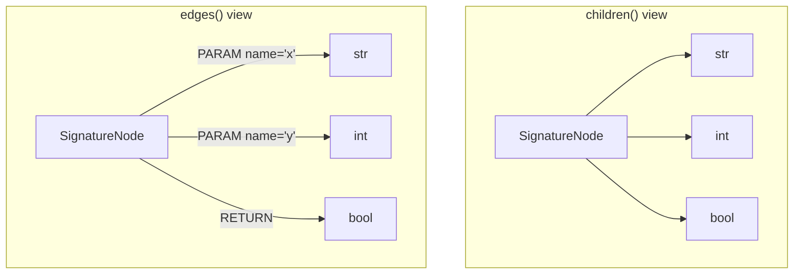
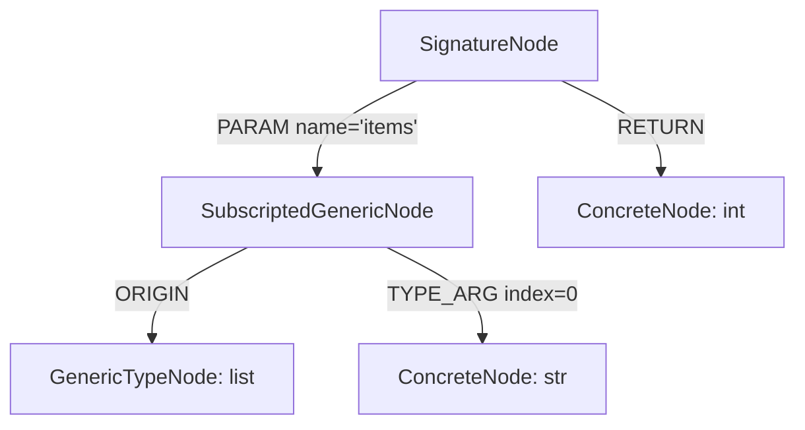

# Graph edges and semantic relationships

When you traverse a type graph, knowing that a node has children is only part of the story. The real power comes from understanding what each child represents. This page explains edge semantics in the type graph: what relationships exist between nodes, how [`TypeEdgeKind`][typing_graph.TypeEdgeKind] values encode those relationships, and when to use [`edges()`][typing_graph.TypeNode.edges] versus [`children()`][typing_graph.TypeNode.children] for traversal.

## Why edges exist

Consider this type annotation:

```python
mapping: dict[str, int]
```

When you inspect it and call `children()`, you get two child nodes: one for `str` and one for `int`. But which is the key type and which is the value type? The order might seem obvious for dictionaries, but the problem generalizes. A `Callable[[int, str], bool]` has three children: which are parameters and which is the return type? A `TypedDict` might have dozens of fields: what are their names?

```python
from typing_graph import inspect_type

node = inspect_type(dict[str, int])
children = list(node.children())
# Two children, but their roles are ambiguous
```

This ambiguity matters because different use cases require different handling. Schema generators need to know which child represents keys versus values. Serializers treat dictionary keys differently from values. Documentation tools describe parameters differently from return types. The structural information alone does not tell you enough.

Edges solve this problem by attaching semantic meaning to each parent-child relationship. An edge is not just a connection; it carries a label that explains the relationship's purpose.

## The two traversal APIs

Every [`TypeNode`][typing_graph.TypeNode] provides two methods for accessing its descendants:

| Method       | Returns                        | Information provided                       |
| ------------ | ------------------------------ | ------------------------------------------ |
| `children()` | `Sequence[TypeNode]`           | Child nodes only, no relationship metadata |
| `edges()`    | `Sequence[TypeEdgeConnection]` | Connection pairs with edge metadata        |

The following diagram illustrates how these methods present the same underlying structure differently. Consider a function signature `(x: str, y: int) -> bool`:



The `children()` view shows a flat sequence of nodes. Without more context, you cannot determine which nodes are parameters and which is the return type. The `edges()` view shows labeled connections that distinguish parameter `x` from parameter `y` from the return type. The semantic context is preserved.

!!! note "Performance consideration"
    The `children()` method returns pre-computed tuples without wrapping them in edge metadata objects. For traversal algorithms that only count nodes or check types without needing relationship information, `children()` avoids unnecessary allocations. Use `edges()` when you need the semantic context.

### Choosing between children() and edges()

The choice depends on what information you need from the traversal:

**Choose `children()` for:**

- **Counting nodes**: "How many types are in this graph?"
- **Type checking**: "Are there any `ForwardRefNode` instances?"
- **Generic traversal**: "Visit every node and collect its metadata"
- **Performance-critical code**: When avoiding extra allocations matters

**Choose `edges()` for:**

- **Schema generation**: Distinguishing keys from values, parameters from returns
- **Serialization**: Field names determine JSON structure
- **Documentation**: Parameter names appear in function signatures
- **Structural analysis**: Understanding how types compose together

## Edge anatomy

Three types work together to represent edges in the type graph:

[`TypeEdgeKind`][typing_graph.TypeEdgeKind]
:   An enum identifying the semantic relationship. Values like `KEY`, `VALUE`, `PARAM`, `RETURN`, and `FIELD` describe what role the child plays relative to its parent. This is the core semantic label.

[`TypeEdge`][typing_graph.TypeEdge]
:   A frozen dataclass containing the `kind` plus optional `name` and `index` attributes. The `name` appears on edges where identifiers matter (for example, `name='username'` for a field edge). The `index` appears on positional edges (for example, `index=0` for the first tuple element).

[`TypeEdgeConnection`][typing_graph.TypeEdgeConnection]
:   A frozen dataclass pairing a `TypeEdge` with its `target` TypeNode. This is what `edges()` returns: the complete picture of relationship plus destination.

```python
from typing_graph import inspect_type

node = inspect_type(tuple[str, int, bool])
for conn in node.edges():
    edge = conn.edge
    print(f"kind={edge.kind.name}, index={edge.index}, target={conn.target}")
# kind=ELEMENT, index=0, target=ConcreteNode(cls=str)
# kind=ELEMENT, index=1, target=ConcreteNode(cls=int)
# kind=ELEMENT, index=2, target=ConcreteNode(cls=bool)
```

The edge provides the semantic context (this is a tuple element) while the index provides positional information (this is element 0, 1, or 2).

## Edge kinds by category

[`TypeEdgeKind`][typing_graph.TypeEdgeKind] defines over twenty edge kinds. Rather than memorizing each one, understanding the categories helps you predict what edges you will encounter for different node types.

### Structural edges

Structural edges connect container types to their contents. They describe how data structures compose smaller types into larger ones:

| Edge kind          | Typical parent           | Child represents              |
| ------------------ | ------------------------ | ----------------------------- |
| `ELEMENT`          | `TupleNode`              | Positional element (indexed)  |
| `KEY`              | dict-like types          | Dictionary key type           |
| `VALUE`            | dict-like types          | Dictionary value type         |
| `UNION_MEMBER`     | `UnionNode`              | One variant of the union      |
| `ALIAS_TARGET`     | `TypeAliasNode`          | The aliased type definition   |

These edges answer questions about data structure: "What types does this container hold?" and "Where in the structure does each type appear?"

```python
from typing_graph import inspect_type

node = inspect_type(tuple[str, int])
for conn in node.edges():
    if conn.edge.kind.name == "ELEMENT":
        print(f"Element {conn.edge.index}: {conn.target}")
# Element 0: ConcreteNode(cls=str)
# Element 1: ConcreteNode(cls=int)
```

### Named edges

Named edges carry identifier information for fields, methods, and parameters. Unlike structural edges where position matters, named edges associate types with their symbolic names:

| Edge kind | Typical parent                         | Child represents                |
| --------- | -------------------------------------- | ------------------------------- |
| `FIELD`   | `TypedDictNode`, `DataclassNode`       | Named field type                |
| `METHOD`  | `ProtocolNode`, `ClassNode`            | Named method signature          |
| `PARAM`   | `CallableNode`, `SignatureNode`        | Parameter type (may have name)  |
| `RETURN`  | `CallableNode`, `SignatureNode`        | Return type                     |

These edges answer questions about identity: "What is this field called?" and "What parameter does this type belong to?"

```python
from typing import TypedDict
from typing_graph import inspect_typed_dict

class User(TypedDict):
    name: str
    age: int

node = inspect_typed_dict(User)
for conn in node.edges():
    print(f"Field '{conn.edge.name}': {conn.target}")
# Field 'name': ConcreteNode(cls=str)
# Field 'age': ConcreteNode(cls=int)
```

### Meta-type edges

Meta-type edges connect to type system machinery rather than data structure. They describe relationships between types and their generic parameters, origins, bounds, and other type-theoretic constructs:

| Edge kind    | Typical parent           | Child represents                                    |
| ------------ | ------------------------ | --------------------------------------------------- |
| `ORIGIN`     | `SubscriptedGenericNode` | Generic origin (for example, `list` in `list[int]`) |
| `TYPE_ARG`   | `SubscriptedGenericNode` | Applied type argument                               |
| `TYPE_PARAM` | `GenericTypeNode`        | TypeVar definition                                  |
| `BOUND`      | `TypeVarNode`            | TypeVar upper bound                                 |
| `RESOLVED`   | `ForwardRefNode`         | Successfully resolved type                          |

These edges answer questions about type construction: "What generic did this come from?" and "What type arguments were applied?"

```python
from typing_graph import inspect_type

node = inspect_type(list[int])
for conn in node.edges():
    print(f"{conn.edge.kind.name}: {conn.target}")
# ORIGIN: GenericTypeNode(cls=list)
# TYPE_ARG: ConcreteNode(cls=int)
```

??? info "Complete edge kind reference"
    For the full list of all `TypeEdgeKind` values with detailed semantics for each, see the [API reference][typing_graph.TypeEdgeKind]. The preceding categories cover the most commonly encountered edges; the reference documents specialized edges like `NARROWS` (for TypeGuard/TypeIs), `SUPERTYPE` (for NewType), and others.

## A complex example

The following diagram shows how multiple edge kinds combine in a realistic type. Consider a function signature like `(items: list[str]) -> int`:



This graph reveals the full structure:

- The function has one parameter named `items` with a complex type
- The return type is a simple `int`
- The parameter type is a `list` (shown via the `ORIGIN` edge) subscripted with `str` (shown via the `TYPE_ARG` edge)

Each edge kind serves its purpose: `PARAM` and `RETURN` distinguish callable parts, `ORIGIN` connects to the generic template, and `TYPE_ARG` shows what types were substituted. Together they provide complete information for any tool that needs to understand this function's type signature.

## When edges matter

Different use cases demand different levels of edge information. Understanding when edges are essential helps you design efficient traversal strategies.

**Schema generation** requires structural edges to distinguish keys from values, required fields from optional ones, and positional parameters from keyword-only ones. Without edges, a schema generator could not correctly represent `dict[str, int]` versus `tuple[str, int]`. Both have two children, but the schema structure differs fundamentally.

**Serialization** uses named edges to match field names to output keys. A serializer inspecting a `TypedDict` needs the `FIELD` edge names to produce `{"name": "Alice", "age": 30}` rather than an array `["Alice", 30]`. The semantic relationship between name and value depends on knowing the field identifier.

**Documentation tools** use parameter edges to render function signatures with meaningful names: `process(items: list[str], count: int)` rather than `process(arg0, arg1)`. Technical writers need the same information that developers see in source code.

**Validation frameworks** use edge indices to report errors at specific positions: "Element 2 of tuple failed validation" requires knowing which element sits at index 2. Generic error messages like "a child node failed" provide less actionable feedback.

## Design rationale

Why does typing-graph provide both `children()` and `edges()` rather than just one unified method?

**Why not just edges?** Edge metadata adds overhead. Every traversal would create `TypeEdge` and `TypeEdgeConnection` objects even when the semantic information serves no purpose. For performance-sensitive code, this overhead accumulates. The `children()` method provides a fast path that returns pre-computed tuples with no extra allocation.

**Why not just children?** Losing semantic information would force consumers to reconstruct it. A schema generator would need to check "is this a `SubscriptedGenericNode` with `dict` origin?" and then know by convention that child 0 is the key and child 1 is the value. This reconstructed logic would be error-prone, duplicated across every consumer, and fragile to implementation changes.

> The design embodies a principle: pay only for what you use.

Simple traversal algorithms use `children()` and pay no edge overhead. Semantic analysis uses `edges()` and gets rich context. Neither penalizes the other. The library pre-computes both representations during node construction, so neither method performs extra work at call time.

This trade-off also appears in how you write traversal code. When using the [`walk()`][typing_graph.walk] function for deep traversal, you get nodes without edge context. The standard `filter` parameter lets you prune based on node properties. For edge-aware traversal, you can iterate `edges()` recursively and make decisions based on relationship type. The appropriate choice depends on whether your algorithm needs the semantic labels.

## Practical application

Now that you understand edge semantics:

- **Traverse efficiently** with [Walking the type graph](../guides/walking-type-graph.md)
- **Filter during traversal** with [Filtering with walk()](../guides/filtering-with-walk.md)
- **Access edge types** in the [API reference](../reference/api.md#edge-types)

## See also

- [`TypeEdgeKind`][typing_graph.TypeEdgeKind] - Complete enumeration of edge kinds
- [`TypeEdge`][typing_graph.TypeEdge] - Edge metadata class
- [`TypeEdgeConnection`][typing_graph.TypeEdgeConnection] - Edge-target pair
- [Architecture overview](architecture.md) - How edges fit into the type graph design
- [Type graph](../reference/glossary.md#type-graph) - Glossary definition
