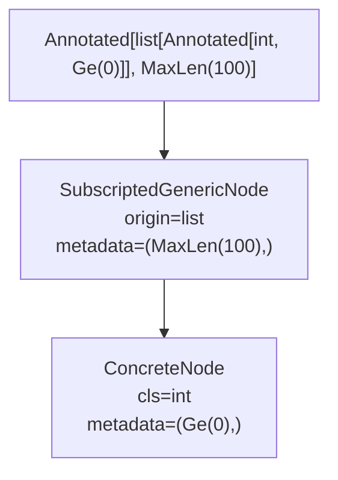

# Metadata and annotated types

This page explains how typing-graph handles `Annotated` types and the metadata they carry.

## Understanding annotated types

[PEP 593](https://peps.python.org/pep-0593/) introduced `typing.Annotated` as a way to attach arbitrary metadata to type annotations:

```python
from typing import Annotated

# Attach validation constraints to a type
age: Annotated[int, Gt(0), Le(150)]

# Attach documentation
name: Annotated[str, Doc("The user's full name")]
```

The first argument is always the actual type (`int`, `str`). Everything after that is metadata—Python objects that provide extra information about the type.

## Why metadata matters

Metadata enables declarative programming patterns. Instead of writing imperative validation:

```python
# snippet - illustrative pattern
def create_user(age: int) -> User:
    if age <= 0:
        raise ValueError("age must be positive")
    if age > 150:
        raise ValueError("age must be <= 150")
    ...
```

You declare the constraints directly in the type annotation:

```python
# snippet - illustrative pattern
def create_user(age: Annotated[int, Gt(0), Le(150)]) -> User:
    ...
```

Tools can then extract this metadata to generate validators, documentation, schemas, or other artifacts.

## Distinguishing container-level and element-level metadata

Consider this type annotation:

```python
scores: Annotated[list[Annotated[int, Ge(0)]], MaxLen(100)]
```

Two distinct pieces of metadata exist here:

1. **Container-level**: `MaxLen(100)` applies to the list itself
2. **Element-level**: `Ge(0)` applies to each integer in the list

typing-graph preserves this distinction. When you call [`inspect_type()`][typing_graph.inspect_type], each level of the graph carries only its own metadata:

```python
from typing import Annotated
from annotated_types import Ge, MaxLen
from typing_graph import inspect_type

scores_type = Annotated[list[Annotated[int, Ge(0)]], MaxLen(100)]
node = inspect_type(scores_type)

# The outer list carries container-level metadata
print(node.metadata)  # (MaxLen(100),)

# The inner int carries element-level metadata
int_node = node.args[0]  # Get the list's element type
print(int_node.metadata)  # (Ge(0),)
```

## Metadata hoisting

By default, typing-graph **hoists** metadata from `Annotated` wrappers to the underlying type. This simplifies working with annotated types because you get the actual type directly—a [`ConcreteNode`][typing_graph.ConcreteNode] or [`SubscriptedGenericNode`][typing_graph.SubscriptedGenericNode]—with metadata attached:

```python
from typing import Annotated
from typing_graph import inspect_type, ConcreteNode

node = inspect_type(Annotated[str, "some metadata"])

# With hoisting (default), you get ConcreteNode directly
print(type(node).__name__)  # ConcreteNode
print(node.cls)             # <class 'str'>
print(node.metadata)        # ('some metadata',)
```

### The annotated type node

typing-graph provides an [`AnnotatedNode`][typing_graph.AnnotatedNode] node type for representing the structure of `Annotated` types when needed. This is primarily useful when building your own type processing that needs to explicitly track Annotated wrappers:

```python
from typing_graph import AnnotatedNode

# AnnotatedNode has base and annotations attributes
# base: the underlying TypeNode
# annotations: the raw Annotated metadata tuple
```

In standard inspection, metadata is automatically hoisted to the underlying type's `metadata` attribute for convenience.

## Working with metadata

The `metadata` attribute on every [`TypeNode`][typing_graph.TypeNode] is a tuple of objects. You can filter, search, and process these objects:

```python
from typing import Annotated
from annotated_types import Gt, Le, Ge
from typing_graph import inspect_type

age_type = Annotated[int, Gt(0), Le(150), "age in years"]
node = inspect_type(age_type)

# Find all numeric constraints
constraints = [m for m in node.metadata if isinstance(m, (Gt, Le, Ge))]
print(constraints)  # [Gt(gt=0), Le(le=150)]

# Find documentation strings
docs = [m for m in node.metadata if isinstance(m, str)]
print(docs)  # ['age in years']
```

## Nested annotated types

Python allows nesting `Annotated` types. When you enable hoisting, typing-graph flattens nested metadata:

```python
from typing import Annotated
from typing_graph import inspect_type

# Nested Annotated
nested = Annotated[Annotated[int, "inner"], "outer"]
node = inspect_type(nested)

# Metadata from both levels is combined
print(node.metadata)  # ('inner', 'outer')
print(type(node).__name__)  # ConcreteNode
```

The metadata tuple preserves order: inner metadata appears before outer metadata.

## How inspection flows through metadata



The library hoists metadata at each level—the outer `MaxLen(100)` attaches to the list node, while the inner `Ge(0)` attaches to the int node. This keeps the graph flat while making metadata directly accessible on each node.

## See also

- [Configuration options](../guides/configuration.md) - Configuration options for type inspection
- [Architecture overview](architecture.md) - How metadata hoisting fits into the inspection process
- [Extracting metadata](../guides/extracting-metadata.md) - Practical patterns for working with metadata
