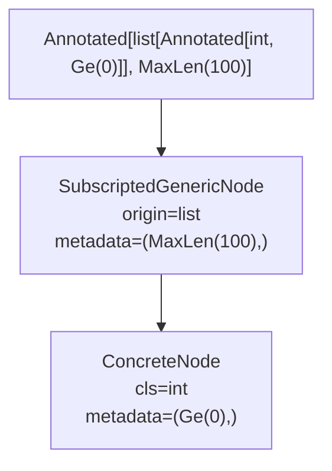

# Metadata and annotated types

This page explains how typing-graph handles `Annotated` types and the metadata they carry. Understanding metadata is essential because it's how modern Python libraries attach validation rules, documentation, and other information directly to type annotations.

## Why metadata matters

Before `Annotated` existed, libraries had to invent their own mechanisms for associating extra information with types: decorators, class attributes, separate schema definitions, or runtime registration. Each approach had drawbacks: decorators separated the information from the type, class attributes required modifying the class, and schemas duplicated type information.

`Annotated` solved this by making the type annotation itself carry the extra information. A single annotation like `Annotated[int, Gt(0), Le(150)]` tells you both the type (`int`) and the constraints (`Gt(0)`, `Le(150)`). This declarative approach has become the foundation for modern validation libraries like Pydantic and msgspec.

typing-graph extracts and organizes this metadata so you can work with it programmatically: finding all constraints on a type, filtering metadata by kind, or traversing a type graph while preserving metadata at each level.

## Understanding annotated types

[PEP 593](https://peps.python.org/pep-0593/) introduced `typing.Annotated` as a way to attach arbitrary metadata to type annotations:

```python
from typing import Annotated

# Attach validation constraints to a type
age: Annotated[int, Gt(0), Le(150)]

# Attach documentation
name: Annotated[str, Doc("The user's full name")]
```

The first argument is always the actual type (`int`, `str`). Everything after that is metadata, which consists of Python objects that provide extra information about the type.

## Declarative patterns with metadata

Metadata enables declarative programming patterns.

=== "Declarative (with metadata)"

    ```python
    # snippet - illustrative pattern
    def create_user(age: Annotated[int, Gt(0), Le(150)]) -> User:
        ...
    ```

=== "Imperative (without metadata)"

    ```python
    # snippet - illustrative pattern
    def create_user(age: int) -> User:
        if age <= 0:
            raise ValueError("age must be positive")
        if age > 150:
            raise ValueError("age must be <= 150")
        ...
    ```

The declarative approach moves constraints into the type system. Tools can then extract this metadata to generate validators, documentation, schemas, or other artifacts.

## Distinguishing container-level and element-level metadata

!!! note "Key concept: metadata levels"

    Understanding the difference between container-level and element-level metadata is crucial for working with complex types. Metadata always applies to the type it's directly attached to, not to nested types.

Consider this type annotation:

```python
scores: Annotated[list[Annotated[int, Ge(0)]], MaxLen(100)]
```

Two distinct pieces of metadata exist here:

1. **Container-level**: `MaxLen(100)` applies to the list itself
2. **Element-level**: `Ge(0)` applies to each integer in the list

typing-graph preserves this distinction. When you call [`inspect_type()`][typing_graph.inspect_type], each level of the graph carries only its own metadata:

```python
from typing import Annotated
from annotated_types import Ge, MaxLen
from typing_graph import inspect_type

scores_type = Annotated[list[Annotated[int, Ge(0)]], MaxLen(100)]
node = inspect_type(scores_type)

# The outer list carries container-level metadata
print(list(node.metadata))  # [MaxLen(max_length=100)]

# The inner int carries element-level metadata
int_node = node.args[0]  # Get the list's element type
print(list(int_node.metadata))  # [Ge(ge=0)]
```

## Metadata hoisting

By default, typing-graph **hoists** metadata from `Annotated` wrappers to the underlying type. This simplifies working with annotated types because you get the actual type directly (a [`ConcreteNode`][typing_graph.ConcreteNode] or [`SubscriptedGenericNode`][typing_graph.SubscriptedGenericNode]) with metadata attached:

```python
from typing import Annotated
from typing_graph import inspect_type, ConcreteNode

node = inspect_type(Annotated[str, "some metadata"])

# With hoisting (default), you get ConcreteNode directly
print(type(node).__name__)  # ConcreteNode
print(node.cls)             # <class 'str'>
print(list(node.metadata))  # ['some metadata']
```

!!! note "Design trade-off: hoisting vs preservation"

    Hoisting is the default because it matches how most code wants to work with annotated types. When you ask "what type is this field?", you usually want the answer to be "it's a string" rather than "it's an Annotated wrapper around a string."

    However, hoisting loses structural information. The distinction between `Annotated[str, X]` and `str` with metadata `(X,)` disappears. For use cases like type reconstruction or round-trip serialization, you can disable hoisting with `hoist_metadata=False` to preserve the original structure.

### The annotated type node

typing-graph provides an [`AnnotatedNode`][typing_graph.AnnotatedNode] node type for representing the structure of `Annotated` types when needed. This is primarily useful when building your own type processing that needs to explicitly track Annotated wrappers:

```python
from typing_graph import AnnotatedNode

# AnnotatedNode has base and annotations attributes
# base: the underlying TypeNode
# annotations: the raw Annotated metadata tuple
```

In standard inspection, metadata is automatically hoisted to the underlying type's `metadata` attribute for convenience.

## Working with metadata

The `metadata` attribute on every [`TypeNode`][typing_graph.TypeNode] is a [`MetadataCollection`][typing_graph.MetadataCollection], an immutable, type-safe container with methods for querying, filtering, and transforming metadata:

```python
from typing import Annotated
from annotated_types import Gt, Le, Ge
from typing_graph import inspect_type

age_type = Annotated[int, Gt(0), Le(150), "age in years"]
node = inspect_type(age_type)

# Find all numeric constraints using MetadataCollection methods
constraints = node.metadata.find_all(Gt, Le, Ge)
print(list(constraints))  # [Gt(gt=0), Le(le=150)]

# Find documentation strings
docs = node.metadata.find_all(str)
print(list(docs))  # ['age in years']
```

## Nested annotated types

Python allows nesting `Annotated` types. When you enable hoisting, typing-graph flattens nested metadata:

```python
from typing import Annotated
from typing_graph import inspect_type

# Nested Annotated
nested = Annotated[Annotated[int, "inner"], "outer"]
node = inspect_type(nested)

# Metadata from both levels is combined
print(node.metadata)  # ('inner', 'outer')
print(type(node).__name__)  # ConcreteNode
```

The metadata tuple preserves order: inner metadata appears before outer metadata.

## How inspection flows through metadata



The library hoists metadata at each level: the outer `MaxLen(100)` attaches to the list node, while the inner `Ge(0)` attaches to the int node. This keeps the graph flat while making metadata directly accessible on each node.

<!-- vale Google.Headings = NO -->

## MetadataCollection design

<!-- vale Google.Headings = YES -->

The [`MetadataCollection`][typing_graph.MetadataCollection] class provides a rich API for working with metadata while maintaining important invariants. Understanding the design rationale helps you use the API effectively.

### Why immutable?

`MetadataCollection` is immutable: all transformation methods return new collections rather than modifying the existing one. This design enables:

- **Thread safety**: Collections can be shared across threads without synchronization
- **Safe caching**: The library caches `TypeNode` instances, and immutable metadata ensures cache integrity
- **Functional patterns**: Method chaining like `coll.filter(...).sorted().unique()` works predictably

??? abstract "The functional programming influence"

    `MetadataCollection`'s API draws from functional programming traditions. Operations like `filter()`, `map()`, and `partition()` return new collections rather than modifying in place. This design enables composability: you can chain operations without worrying about one step affecting another.

    The trade-off is memory allocation, since each operation creates a new collection. In practice, metadata collections are small (typically 1-5 items), so this overhead is negligible. For hot paths with large collections, consider whether you need to materialize intermediate results at all.

### Why not subclass tuple?

While `MetadataCollection` wraps a tuple internally, it doesn't inherit from `tuple`. This design choice provides:

- **Explicit semantics**: A `MetadataCollection` is clearly metadata, not just any tuple
- **Type safety**: Methods like `find()` return properly typed results, not generic `Any`
- **Method namespace control**: No inherited tuple methods that don't make sense for metadata (for example, `count` with different semantics)

<!-- vale Google.Headings = NO -->

### GroupedMetadata automatic flattening

<!-- vale Google.Headings = YES -->

The `annotated-types` library defines `GroupedMetadata`, a protocol for metadata that contains other metadata. For example, `Interval(ge=0, le=100)` groups `Ge(0)` and `Le(100)`. See [Expanding grouped constraints](../guides/metadata-transformations.md#expanding-grouped-constraints) for more on how to work with grouped metadata.

By default, `MetadataCollection` automatically flattens `GroupedMetadata`:

```python
from annotated_types import Interval
from typing_graph import MetadataCollection

interval = Interval(ge=0, le=100)
coll = MetadataCollection.of([interval])
print(list(coll))  # [Ge(ge=0), Le(le=100)]
```

??? abstract "Technical details: hoisting implementation"

    Metadata hoisting happens during type inspection, not during `MetadataCollection` construction. The inspection process:

    1. Detects `Annotated[T, ...]` origin
    2. Extracts metadata arguments (everything after the first argument)
    3. Creates appropriate node type for `T` (for example, `ConcreteNode` for concrete types)
    4. Attaches metadata to the node's `metadata` attribute

    This design keeps `MetadataCollection` simple, as it doesn't need to understand `Annotated` types. All the complexity lives in the type inspector.

This default makes sense because most code wants to work with individual constraints, not their groupings. To preserve `GroupedMetadata` structure, use `auto_flatten=False`:

```python
coll = MetadataCollection.of([interval], auto_flatten=False)
print(list(coll))  # [Interval(ge=0, le=100)]
```

## Performance characteristics

`MetadataCollection` is designed for efficient metadata operations with predictable performance characteristics. Most common operations complete in microseconds or nanoseconds.

### Complexity reference

The following table summarizes the Big-O complexity for all public methods:

| Category | Method | Complexity | Notes |
| -------- | ------ | ---------- | ----- |
| **Construction** | `of()` | O(n) | Linear in item count |
| | `from_annotated()` | O(n) | Includes type introspection overhead |
| | `EMPTY` | O(1) | Singleton access |
| **Query** | `find()` | O(n) worst, O(1) best | Stops at first match |
| | `find_first()` | O(n) | Checks multiple types |
| | `find_all()` | O(n) | Single pass for all matches |
| | `get()` | O(n) | Same as `find()` |
| | `get_required()` | O(n) | Same as `find()` |
| | `has()` | O(n) | Stops at first match |
| | `count()` | O(n) | Full scan required |
| **Filtering** | `filter()` | O(n) | Predicate called on each item |
| | `filter_by_type()` | O(n) | Type check plus predicate |
| | `first()` | O(n) | Stops at first match |
| | `first_of_type()` | O(n) | Type check plus predicate |
| | `any()` | O(n) | Stops at first match |
| | `find_protocol()` | O(n) | High overhead per item |
| | `has_protocol()` | O(n) | Stops at first match |
| | `count_protocol()` | O(n) | Full scan required |
| **Transformation** | `__add__`, `__or__` | O(n+m) | Concatenation |
| | `exclude()` | O(n) | Creates new collection |
| | `unique()` | O(n) hashable, O(n^2) unhashable | Hash-based deduplication |
| | `sorted()` | O(n log n) | Python's Timsort |
| | `reversed()` | O(n) | Creates new collection |
| | `map()` | O(n) | Function call per item |
| | `partition()` | O(n) | Single pass |
| **Introspection** | `types()` | O(n) | Builds frozenset |
| | `by_type()` | O(n) | Groups by type |
| **Sequence** | `__len__` | O(1) | Tuple length |
| | `__bool__` | O(1) | Tuple truthiness |
| | `is_empty` | O(1) | Tuple negation |
| | `__getitem__` (index) | O(1) | Tuple index |
| | `__getitem__` (slice) | O(k) | k is slice size |
| | `__contains__` | O(n) | Linear search |
| | `__iter__` | O(n) | Tuple iteration |
| **Equality/Hash** | `__eq__` | O(1) early, O(n) worst | Length check first |
| | `__hash__` | O(n) | Hashes all items |
| | `is_hashable` | O(n) | Attempts hash |

### Timing characteristics

!!! info "Benchmarks in progress"

    Rigorous performance benchmarks with statistical analysis are being developed. The relative performance characteristics below are based on preliminary measurements and may be refined in future releases.

All core operations are designed for sub-microsecond performance in typical use cases:

- **Sequence operations** (`len()`, `bool()`, `is_empty`): Fast constant-time operations
- **Early exit methods** (`find()`, `has()`, `first()`, `any()`): Fast when matches are found early
- **Full-scan methods** (`find_all()`, `count()`, `filter()`): Linear time, fast for typical collection sizes
- **Transformation methods** (`sorted()`, `unique()`): Slightly slower due to allocation, but still fast for typical sizes
- **Protocol methods** (`find_protocol()`, `has_protocol()`): Noticeably slower due to typing module overhead

### Method selection guide

When performance matters, choose methods that stop early:

- **Prefer `find()` over `find_all()`** when you only need the first match
- **Prefer `has()` over `count()`** when you only need existence
- **Prefer `first()` over `filter()`** when you only need one result
- **Prefer `any()` over `filter()` + `bool()`** for existence checks
- **Avoid `find_protocol()` in hot paths**: use `find()` with concrete types when possible

For equality comparisons, different-length collections return immediately (O(1)), so `__eq__` is fast for the common case of comparing unequal collections.

### Performance caveats

!!! warning "Protocol methods in hot paths"

    Protocol-based methods (`find_protocol()`, `has_protocol()`, `count_protocol()`) have significant overhead due to Python's typing module introspection. For hot paths, prefer concrete type matching with `find()` or `has()`.

1. **Protocol filtering overhead**: Protocol-based methods have significant per-item overhead due to Python's typing module introspection. For hot paths, prefer concrete type matching with `find()` or `has()`.

2. **Function call overhead**: Simple property access (`len()`, `bool()`, `is_empty`) incurs minimal Python function/property call overhead. This is unavoidable for method calls but negligible for most use cases.

3. **Tuple hash computation**: The `is_hashable` property and `__hash__` must compute the hash of the entire underlying tuple. For large collections with many items, this scales linearly.

4. **Unhashable item deduplication**: The `unique()` method falls back to O(n^2) comparison-based deduplication when items are unhashable. For collections with unhashable items and many duplicates, consider filtering before calling `unique()`.

## The ecosystem context

`Annotated` metadata has become central to the Python ecosystem's approach to runtime type information. Libraries have converged on common patterns:

- **annotated-types** provides standard constraint types (`Gt`, `Le`, `MaxLen`) that work across libraries
- **Pydantic** uses `Annotated` metadata for field configuration and validation
- **msgspec** uses it for struct field definitions
- **FastAPI** uses it for parameter validation and OpenAPI generation

typing-graph's metadata handling is designed to work with all these approaches. The `MetadataCollection` API doesn't assume any particular metadata schema. It works equally well with annotated-types constraints, Pydantic field info objects, or custom metadata classes.

## Practical application

Now that you understand metadata concepts, apply this knowledge:

- **Learn metadata basics** with [Working with metadata](../tutorials/working-with-metadata.md)
- **Find specific metadata** with [Querying metadata](../guides/metadata-queries.md)
- **Filter by conditions** with [Filtering metadata](../guides/metadata-filtering.md)
- **Transform collections** with [Transforming metadata](../guides/metadata-transformations.md)
- **Real-world patterns** in [Metadata recipes](../guides/metadata-recipes.md)

## See also

- [Working with metadata](../tutorials/working-with-metadata.md) - Tutorial introduction to MetadataCollection
- [Configuration options](../guides/configuration.md) - Controlling metadata hoisting
- [Architecture overview](architecture.md) - How metadata hoisting fits into the inspection process
- [MetadataCollection](../reference/glossary.md#metadata-collection) - Glossary definition
- [Annotated type](../reference/glossary.md#annotated-type) - Glossary definition
- [GroupedMetadata](../reference/glossary.md#grouped-metadata) - Glossary definition
- [PEP 593](https://peps.python.org/pep-0593/) - Flexible function and variable annotations
