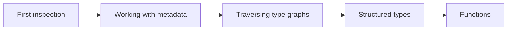

# Tutorials

This section contains learning-oriented lessons that walk through complete examples from start to finish. Start here if you're new to typing-graph and want hands-on experience.

## Recommended learning path

If you're new to typing-graph, follow these tutorials in order:

1. **[Your first type inspection](first-inspection.md)** - Start here to learn the core concepts
2. **[Working with metadata](working-with-metadata.md)** - Understand metadata extraction and queries
3. **[Traversing type graphs](traversing-type-graphs.md)** - Use `walk()` to traverse and collect metadata
4. **[Inspecting structured types](structured-types.md)** - Work with dataclasses, TypedDict, and NamedTuple
5. **[Inspecting functions](functions.md)** - Analyze function signatures and parameters

## All tutorials

[Your first type inspection](first-inspection.md)
:   Learn the fundamentals of type inspection, including how to use [`inspect_type()`][typing_graph.inspect_type], understand [type nodes](../reference/glossary.md#type-node), and access metadata.

[Working with metadata](working-with-metadata.md)
:   Learn how to create, query, and transform [`MetadataCollection`][typing_graph.MetadataCollection] instances for working with type annotation metadata.

[Traversing type graphs](traversing-type-graphs.md)
:   Build a constraint collector that uses [`walk()`][typing_graph.walk] to traverse nested types and collect metadata from any depth.

[Inspecting structured types](structured-types.md)
:   Explore dataclasses, TypedDict, and NamedTuple inspection to extract field definitions and their types.

[Inspecting functions](functions.md)
:   Discover how to inspect function signatures, access parameter information, and work with return types.

## After completing tutorials

Once you've finished the tutorials, you're ready to:

- **Apply your knowledge** with [how-to guides](../guides/index.md) for specific tasks
- **Deepen understanding** with [explanations](../explanation/index.md) of concepts and architecture
- **Look up details** in the [API reference](../reference/api.md)
